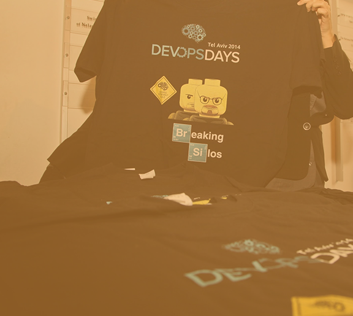
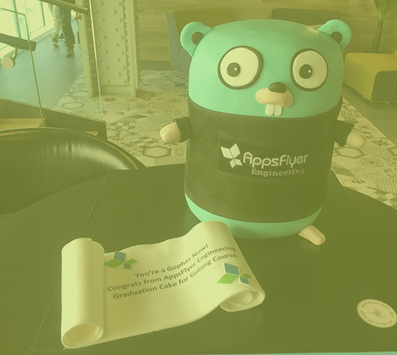

<!-- Main -->

<!-- One -->
<section id="one">
	

			<h2 style="text-transform: uppercase; color:turquoise; font-family: monospace;"><i class="fa fa-hand-scissors-o"></i>  RTFM Please Ltd. - Fractional Developer Relations</h2>
            

         
Most technical products have difficulty properly telling their engineering story. While one developer advocate can do wonders - I help flip this paradigm and evolve your engineers into your product champions and advocates, to help define your strategic technical narrative, and  drive developer-first adoption.

        
    <h4>This is where I can <strong style="text-transform: uppercase; color:turquoise; font-family: monospace;">help</strong>:</h4>
    
    <i class="fa fa-question" style="color:turquoise;"></i>&nbsp;&nbsp;extract excellent engineering stories from your teams with <em style="font-weight: 700; color: turquoise;">minimal friction</em> for your developers  <i class="fa fa-info" style="color:turquoise;"></i>&nbsp;&nbsp;simplify messaging into <em style="font-weight: 700; color: turquoise;">practically understandable concepts</em> for devs (no marketing fluff) <i class="fa fa-lightbulb-o" style="color:turquoise;"></i>&nbsp;&nbsp;optimize product stories for technical audiences - by developers for developers, with some much-needed <em style="font-weight: 700; color: turquoise;">marketing flair</em> <i class="fa fa-code" style="color:turquoise;"></i>&nbsp;&nbsp;get these stories and products in front of the <em style="font-weight: 700; color: turquoise;">right users</em> <i class="fa fa-star" style="color:turquoise;"></i>&nbsp;&nbsp;advocate by empowering internal and external <em style="font-weight: 700; color: turquoise;">product champions</em> to spread the gospel 
     

	

	 <h2>Customer Success Stories</h2>

	<h2 style="text-transform: uppercase; color:turquoise; font-family: monospace;"><i class="fa fa-hand-video-o"></i> Customer Conference Talks</h2>
    <!-- Elfsight YouTube Gallery | RTFM Customers Talk Gallery -->

   

<i class="fa fa-cog"></i>  RTFM Please Customers - Publications & Podcasts 



   

	<h2 style="text-transform: uppercase; color:turquoise; font-family: monospace;"><i class="fa fa-star-o"></i> More Samples of Work</h2>

   

<strong>CONTENT</strong>

    
				
Highlights of content extracted <em style="font-weight: 700; color: turquoise;">from</em> engineers:

				<ul>
				<li><a href="https://medium.com/appsflyer/salting-your-spark-to-scale-e6f1c87dd18" target="_blank">Salting Your Spark to Scale</a></li>
				<li><a href="https://www.infoq.com/articles/api-gateway-clojure-golang/" target="_blank">Rewriting an API Gateway Service from Clojure to Golang: AppsFlyer Experience Report</a></li>
				<li><a href="https://snyk.io/open-source-security/" target="_blank">The State of Open Source Security 2020</a></li>
				<li><a href="https://thenewstack.io/how-to-achieve-ironclad-serverless-security/" target="_blank">How to Achieve Ironclad Serverless Security</a></li>
					</ul>

				
Snapshot of content edited <em style="font-weight: 700; color: turquoise;">with</em> engineers:

				<ul>
				<li><a href="https://devops.com/designing-engineering-teams-for-scale/" target="_blank">Designing Engineering Teams for Scale</a></li>
				<li><a href="https://medium.com/appsflyer/three-tips-for-managing-technical-debt-while-maintaining-developer-velocity-and-sanity-f3d4a080052c" target="_blank">Translation from Hebrew: Three Tips for Managing Technical Debt: While Maintaining Developer Velocity (and Sanity)</a></li>
				<li><a href="https://www.infoq.com/articles/applied-probability-unstructured-events-theta-sketches/" target="_blank">Applied Probability - Counting Large Set of Unstructured Events with Theta Sketches</a></li>
				<li><a href="https://medium.com/appsflyer/repl-based-debugging-in-clojure-278fb468a33" target="_blank">REPL Based Debugging in Clojure</a></li>
				<li><a href="https://medium.com/appsflyer/how-appsflyer-uses-apache-airflow-to-run-over-3-5k-daily-jobs-and-more-683106cb24fc" target="_blank">How AppsFlyer uses Apache Airflow to run more than 3.5k daily jobs</a></li>
					</ul>

				
Content curation:

				
Influencer Blog Post Series - Curation & Editing: <a href="https://devseccon.com/secadvent-2020" target="_blank">SecAdvent 2020</a>

				Some seeded podcast opportunities: 		
				<a href="https://devchat.tv/js-jabber/jsj-456-developer-first-security-and-security-tooling-for-developers-with-liran-tal-brian-vermeer/" target="_blank">Javascript Jabber&nbsp;</a> <i class="icon fa-cog" style="color: turquoise;"></i> <a href="https://www.jonobacon.com/2020/07/14/alyssa-miller-from-snyk-on-the-state-of-open-source-security/" target="_blank">&nbsp;Conversations with Bacon&nbsp;</a> <i class="icon fa-cog" style="color: #d95374;"></i> <a href="https://www.arresteddevops.com/state-of-open-source-security/" target="_blank">&nbsp;Arrested DevOps&nbsp;</a> <i class="icon fa-cog" style="color: #c0d44f;"></i> <a href="https://www.reversim.com/2020/11/398-with-danny-grander-from-snyk.html" target="_blank">&nbsp;Reversim [HEB]&nbsp;</a> <i class="icon fa-cog" style="color: #a472d4;"></i> <a href="https://opensourcesecuritypodcast.libsyn.com/episode-205-the-state-of-open-source-security-with-alyssa-miller-from-snyk" target="_blank">&nbsp;The Open Source Security Podcast&nbsp;</a> <i class="icon fa-cog" style="color: #84d3f6;"></i> <a href="hhttps://www.pageittothelimit.com/dependency-security-with-liran-tal/" target="_blank">&nbsp;Page it to the Limit</a>
				 
				 
				

				

<strong>EVENTS</strong>

				<ul>
				<li>Speaker & Talk Database:&nbsp;<a href="https://github.com/AppsFlyer/engineering-org-resources" target="_blank">&nbsp;AppsFlyer Sample</a></li>
				<li>Hackathon Production:&nbsp; <i class="icon fa-link" style="color: #c0d44f;"></i><a href="https://hackweek.dev" target="_blank">&nbsp;Hackathon Website&nbsp;</a> <i class="icon fa-play" style="color: #c0d44f;"></i> <a href="https://www.youtube.com/watch?v=j6g9Ea38EtI" target="_blank">&nbsp;Hackathon Post-Event Video</a></li>
				<li>Event Production:<a href="https://devopsdaystlv.com" target="_blank">&nbsp;DevOpsDays TLV&nbsp;</a> <i class="icon fa-cog" style="color: #faa344;"></i> <a href="https://cloudnativeisrael.com" target="_blank">&nbsp;Cloud Native Day Tel Aviv&nbsp;</a> <i class="icon fa-cog" style="color: #d95374;"></i> &nbsp;<a href="https://statscraft.org.il" target="_blank">Statscraft&nbsp;</a> <i class="icon fa-cog" style="color: #c0d44f;"></i>  <a href="https://tlvcommunity.dev" target="_blank">&nbsp;Community Summit TLV&nbsp;</a> <i class="icon fa-cog" style="color: #a472d4;"></i> <a href="https://www.devseccon.com/pf/devseccon24-2020/" target="_blank">&nbsp;DevSecCon24</a></li>
				</ul>

				Snapshot of Top-Tier Speaking Opportunities:
				<ul>
				<li>Technology-Specific Events:<a href="https://videos.confluent.io/watch/6KNS8GhQZ5EhKFC2iwz8uW" target="_blank">&nbsp;Kafka Summit&nbsp;</a> <i class="icon fa-cog" style="color: #faa344"></i> <a href="https://www.youtube.com/watch?v=z_6tVRCyJxs" target="_blank">&nbsp;Gitlab Commit&nbsp;</a> <i class="icon fa-cog" style="color: #d95374;"></i> &nbsp;<a href="https://www.youtube.com/watch?v=kul9MTB0niE" target="_blank">SwampUP&nbsp;</a> <i class="icon fa-cog" style="color: #c0d44f;"></i>  <a href="https://www.youtube.com/watch?v=9MzaGFdPfg4&list=PLTGtoghhCRrWLvMGAED5n-haDnNOW8eec&index=18" target="_blank">&nbsp;AWS RE:Invent&nbsp;</a> <i class="icon fa-cog" style="color: #a472d4;"></i> &nbsp;Google Cloud Summit - Keynote</li>

				<li>Leading Industry Events:<a href="https://www.youtube.com/watch?v=HKRJZVjYW4Q&list=PLTGtoghhCRrWLvMGAED5n-haDnNOW8eec&index=17" target="_blank">&nbsp;Velocity &nbsp;</a> <i class="icon fa-cog" style="color: #faa344"></i> <a href="https://www.youtube.com/watch?v=tjjeaCtsw_M&list=PLTGtoghhCRrWLvMGAED5n-haDnNOW8eec&index=16" target="_blank">&nbsp;Strata Data&nbsp;</a> <i class="icon fa-cog" style="color: #d95374;"></i> &nbsp;<a href="https://www.youtube.com/watch?v=F4TUYdjfvsc&list=PLTGtoghhCRrWLvMGAED5n-haDnNOW8eec&index=8" target="_blank">Devoxx [Workshop]&nbsp;</a> <i class="icon fa-cog" style="color: #c0d44f;"></i>  <a href="https://www.youtube.com/watch?v=_c6kSKrhTz8&list=PLTGtoghhCRrWLvMGAED5n-haDnNOW8eec&index=10" target="_blank">&nbsp;Devoxx [Talk]&nbsp;</a> <i class="icon fa-cog" style="color: #a472d4;"></i><a href="https://www.youtube.com/watch?v=aSceJNfIARc" target="_blank"> &nbsp;Codemotion</a></li>

				<li>Ecosystem Specific Events:<a href="https://www.youtube.com/watch?v=asqgKaUMXq0" target="_blank">&nbsp;ReactNext &nbsp;</a> <i class="icon fa-cog" style="color: #faa344"></i> <a href="https://www.youtube.com/watch?v=vUEKL8zekXc" target="_blank">&nbsp;GoLab&nbsp;</a> <i class="icon fa-cog" style="color: #d95374;"></i> &nbsp;<a href="https://www.youtube.com/watch?v=cc9NJSf0hfc" target="_blank">Gophercon TLV&nbsp;</a> <i class="icon fa-cog" style="color: #c0d44f;"></i>  <a href="https://www.youtube.com/watch?v=VgROF_J9ypU&list=PLTGtoghhCRrWLvMGAED5n-haDnNOW8eec&index=12" target="_blank">&nbsp;Clojure Conferences</a> [MANY - ONE SAMPLE]&nbsp; </li>

				<li>Leading Israeli Events:<a href="https://www.youtube.com/watch?v=Fg1SJufaHOs" target="_blank">&nbsp;DevOpsDays &nbsp;</a> <i class="icon fa-cog" style="color: #faa344"></i> <a href="https://www.youtube.com/watch?v=Wq0i7VD7-ug" target="_blank">&nbsp;Cloud Native & OSS Day&nbsp;</a> <i class="icon fa-cog" style="color: #d95374;"></i> &nbsp;<a href="https://www.youtube.com/watch?v=aejjRzjGYOE" target="_blank">Reversim&nbsp;</a></li>				
				</ul>

				

				

<strong>BRANDING & MESSAGING</strong>

				<li>Messaging and Other Projects:<a href="https://www.pagerduty.com/integrations/jovianx/" target="_blank">&nbsp;JovianX and PagerDuty Integration &nbsp;</a> <i class="icon fa-cog" style="color: #faa344"></i> <a href="https://cloud.google.com/customers/appsflyer" target="_blank">&nbsp;Google Cloud Case Study&nbsp;</a> <i class="icon fa-cog" style="color: #d95374;"></i> &nbsp;<a href="https://medium.com/appsflyer/appsflyer-engineering-in-numbers-wrapping-up-2019-25ab4888fc09" target="_blank">AppsFlyer Infographic&nbsp;</a></li>

				<li>Github Pages & Sites:<a href="https://appsflyer.github.io" target="_blank">&nbsp;AppsFlyer &nbsp;</a> <i class="icon fa-cog" style="color: #faa344"></i> <a href="https://cloudify-cosmo.github.io" target="_blank">&nbsp;Cloudify&nbsp;</a> <i class="icon fa-cog" style="color: #d95374;"></i> &nbsp;<a href="https://tlvcommunity.dev" target="_blank">TLV Community&nbsp;</a></li>

				

				 
				<h4 style="text-transform: uppercase; color:turquoise; font-family: monospace;"> <i class="icon fa-plug" style="color: #ffffff"></i>&nbsp;THE TLVCOMMUNITY</h4>				
				<iframe src="https://luma.com/embed/calendar/cal-qmBCPYlhYzHECCs/events?lt=dark"
  width="600"
  height="450"
  frameborder="0"
  style="border: 1px solid #bfcbda88; border-radius: 4px;"
  allowfullscreen=""
  aria-hidden="false" tabindex="0"></iframe>
   

<!-- 

			

<i class="fa fa-cog"></i>  RTFM Please - Service Offering

 

<table style="overflow-x:auto;">
		<thead>
			<tr>
				<th>Service Type</th>
				<th>Description</th>
				<th>Pricing Scheme</th>
			</tr>
		</thead>
		<tbody>
			<tr>
				<td><strong style="color: turquoise;">Bundles</strong></td>
				<td>Starting at 10-Hour Packages (Up to 40-Hours)</td>
				<td>Based on daily fee.</td>
			</tr>
			<tr>
				<td><strong style="color: turquoise;">Projects</strong></td>
				<td>Specific time-based project - event, hackathon, other production</td>
				<td>Based on scope of work.</td>
			</tr>
			<tr>
				<td><strong style="color: turquoise;">Workshops</strong></td>
				<td> <strong>For your internal employees:</strong> marketers, founders, HR (or whoever else might be interested) - a diversity of workshops on how to do it yourselves, refining your message and pitch, building powerful engineering brands.</td>
				<td>Fixed Price - Up to 10 Participants</td>
			</tr>
			<tr>
				<td><strong style="color: turquoise;">Long-Term Work</strong></td>
				<td>Commitment to at least half-year cycles of ongoing work. </td>
				<td>Retainer</td>
			</tr>
			<tr>
				<td><strong style="color: turquoise;">Power Surge</strong></td>
				<td><strong style="color: red;">DON'T PANIC!</strong> If you're overloaded before a launch, release or peak time of year, have an urgent deliverable or crisis and need more hands on deck - we'll drop everything and give you a hand.</td>
				<td>Based on scope & deadline</td>
			</tr>
		</tbody>
		 <!-- <tfoot>
			<tr>
				<td colspan="2"></td>
				<td>100.00</td>
			</tr>
		</tfoot> 
	</table> 
	

	

	
 -->
</section>

<!-- Two -->

<section id="two" class="spotlights">
	<section>
    
		

			

                <h2 style="text-transform: uppercase; color: #d95374; font-family: monospace;"> { ENGINEERING BRANDS USERS LOVE <i class="fa fa-heart-o"></i> }</h2>
                

                
	
	</section>

    <section>
		
		

			

			<h2 style="text-transform: uppercase; color: #faa344; font-family: monospace;"> { DEVELOPER EVENTS THAT ARE MEMORABLE <i class="fa fa-star-o"></i> }</h2>

			

		

	</section>
    <section>
		
		

			

            <h2 style="text-transform: uppercase; color: #c0d44f; font-family: monospace;"> { TALENT ACQUISITION AND RETENTION <i class="fa fa-bolt"></i> }</h2>
            	

		

	</section>

	</section>
	

	

				
<!-- End -->
