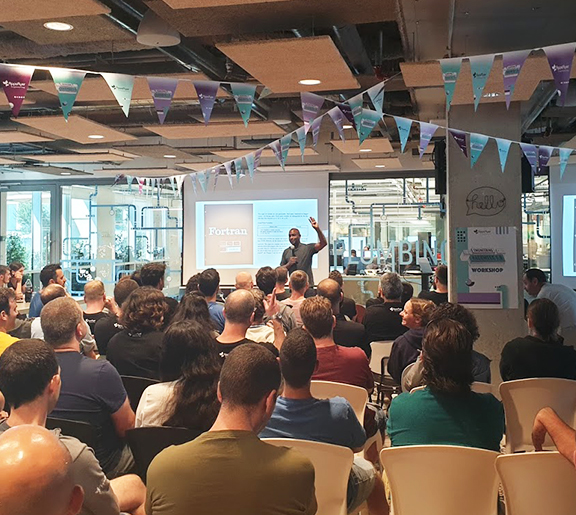
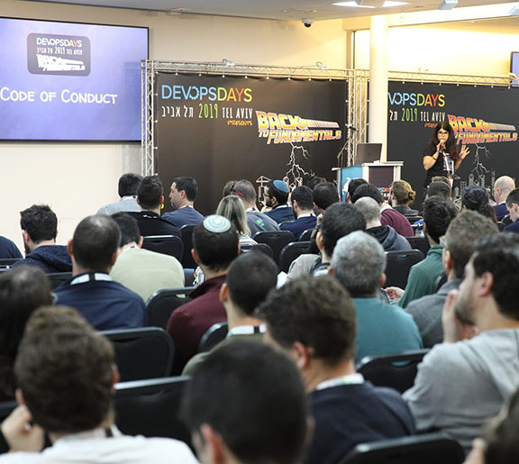
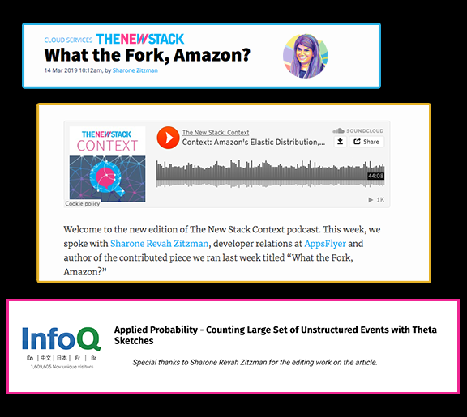

<!-- Main -->

<!-- One -->
<section id="one">
	

		
Hi, I'm Sharone Zitzman, a marketing technologist and open source community builder, who likes to work with engineering teams that are building products that developers love. Having built both the <a href="https://devopsdaystlv.com" target="_blank">DevOps Israel</a> and <a href="https://cloudnativeisrael.com" target="_blank">Cloud Native Israel</a> communities from the ground up, today I spend my time finding the places where technology and people intersect and ensuring that this is an excellent experience. You can find my talks, articles, and employment experience below. Find me on <a href="https://twitter.com/shar1z" target="_blank">Twitter</a> or <a href="https://github.com/shar1z" target="_blank">Github</a> as @shar1z.

	

</section>

<!-- Two -->
<section id="two" class="spotlights">
	<section>
		
		

			

				<h3 style="text-transform: uppercase; color: #d95374; font-family: monospace;">{ <i class="fa fa-cogs"></i> &nbsp;Where I've Worked }</h3>
				

<strong>Head of User Commmunities, Snyk</strong>

				
At Snyk I led two primary communities - the DevSecCon community and Snyk Developer Community

				<strong>Achievements:</strong>
				<ul>
				Some Achievements:
				<li>Infrastructure: Built the Snyk User Community from the ground up, based on Forem.com at <a href="https://community.snyk.io" target="_blank">community.snyk.io</a>, while delivering the ongoing content, live events and breathing heart of the community</li>
				<li>Innovation: Converged two popular DevSecOps communities into one site - mydevsecops.io into <a href="https://devseccon.com" target="_blank">devseccon.com</a> - taking the largely f2f conference site and community to a digitized COVID-ready platform with ongoing technical content and events.</li>
				<li>Growth: Grew DevSecCon community by 150%+ in 6 months, and delivered 2000+ attendee global virtual event</li>
				<li> SEO & Content: Launched the first-ever <a href="https://devseccon.com/secadvent-2020" target="_blank">SecAdvent blog post series</a> with 25 posts throughout December on leading security topics, by influencers in the security industry.</li>
				<li> Reach (<a href="https://community.snyk.io/snyk-team-content" target="_blank">see here</a>): Organized community opps for the extended team on leading podcasts including: Javascript Jabber, Arrested DevOps, Conversations with Bacon, Page it to the Limit, Reversim, the Open Source Security Podcast, and more.</li>
					</ul>
				

				

<strong>Head of Developer Relations, AppsFlyer</strong>

				
After parting from Cloudify - my professional home for more than 7 years, I crystalized that the parts I enjoyed most about my time there was the strong focus on building developer communities and developer-facing products.  And that is why I decided to go all-in on a developer relations role.  In this capacity I am striving to build a culture focused on engineering excellence and craftsmanship, as well as a stellar developer experience for our suite of products and developer tools.

				<strong>Achievements:</strong>
				<ul>
				Built AppsFlyer engineering brand from the ground up, with presence in:
				<li>30+ global conferences (top tier - O'Reilly Events, Kafka Summit, Devoxx, Codemotion and more), 20+ meetups, and participation in 6+ hackathons</li>
				<li>Built a database of developer talks, mentored, and cultivated speaking talent within the organization (See here: <a href="https://github.com/AppsFlyer/engineering-org-resources" target="_blank">AppsFlyer/engineering-org-resources</a>)</li>
				<li>Coded and launched <a href="https://appsflyer.github.io/" target="_blank">appsflyer.github.io</a> page</li>
				<li>Conceptualized, curated & launched the first ever global engineering hackathon:</li>
				<ul>
				<li> With 200+ engineers participating</li>
				<li> 8+ professional workshops (including: IoT, Machine Learning, Public Speaking, Engineering Management, Blockchain and Cryptocurrency among others) </li>
				<li>See <a href="https://hackweek.dev" target="_blank">https://hackweek.dev</a></li>
				</ul>
				<li>Expanded company focus from engineering brand to developer experience, and hired first developer advocate, as developer tools domain expert</li>
				<li>Built sustainable long-term content strategy (See <a href="https://medium.com/appsflyer" target="_blank">medium.com/AppsFlyer</a>)</li>
					</ul>
				

				

<strong>VP Marketing, Cloudify</strong>

				
I was employed at Cloudify -- a spinoff of GigaSpaces Technologies -- from February 2011 through October 2018, where I started by building the open source developer community from the ground up, taking a leadership role in the OpenStack and Cloud Native communities, and finished my career there as VP Marketing having multiplied our revenue and clientele, and led a team focused on marketing & community, lead generation & data analysis, as well as business development.

				<strong>Achievements:</strong>
				<ul>
				<li>Managed a team of senior marketing experts - marketing, community evangelist, data analyst, and business development</li>
				<li>Doubled revenue from 2016 to 2017</li>
				<li>Added $2M ARR from 2017 to 2018</li>
				<li>Tripled customer base - including top tier banks, telcos, and other financial services organizations</li>
				<li>Established Cloudify as a market leader in the Telco vertical</li>
				<li>Led product marketing and developer experience, through the customer journey & funnel</li>
				<li>Built the open source developer community from the ground up serving thousands of developers across a diversity of technologies, platforms, and languages</li>
				</ul>
				

				

<strong>Head of International Marketing & Technical Writer, Comsec Global</strong>

				
Management and execution of the company's local and international marketing strategy, including all aspects of brand management and awareness in English and Hebrew (PR materials, Web and social media presence, product demos, presentations, conferences). This involved working closely with, and supporting the VP Business Development & International Operations, with formulating the strategic marketing work plan for Israel and abroad, while defining measurable KPIs and KSIs to ensure its success; in addition to handling the relations with our local entities in the UK and the Netherlands.

				<strong>Snapshot of responsibilities:</strong>
				<ul>
				<li>Creation of all of the targeted company marketing material: professional technical documentation, PR materials (brochures, press releases, service sheets, position papers, newsletters, ads and more)</li>
				<li>Maintaining the company’s Web presence (including: corporate website, Twitter, blog, Facebook page, LinkedIn page, targeted landing pages for new products, email marketing)</li>
				<li>Product Marketing: Product demos, presentations, and any branding material</li>
				</ul>
				

				 
				

				Find additional employment experience on <a href="https://www.linkedin.com/in/sharonez/" target="_blank">Linkedin</a>.
			

		
		
	</section>
	<section>
		
		

			

					<h3 style="text-transform: uppercase; color: #faa344; font-family: monospace;">{ <i class="fa fa-magic"></i> &nbsp;What I've Learned }</h3>
				<ul>
				<li>Technology, product and developer-focused marketing</li>
				<li>Optimizing the developer experience of products</li>
				<li>Simplifying complex technology concepts</li>
				<li>Empowering engineering brands</li>
				<li>Hacking developer communities for scale</li>
				<li>End-to-end technology events management</li>
				</ul>
			

		

	</section>
	<section>
		
		

			

					<h3 style="text-transform: uppercase; color: #c0d44f; font-family: monospace;">{ <i class="fa fa-hand-peace-o"></i> &nbsp;Street Cred }</h3>
				

<strong>Writing & Publications</strong>

				<ul>
				<li>WRITING: <a href="https://thenewstack.io/challenge-industry-norms-and-redefine-your-technology-roles/" target="_blank">Challenge Industry Norms and Redefine Your Technology Roles</a></li>
				<li>WRITING: <a href="https://thenewstack.io/what-the-fork-amazon/" target="_blank">What the Fork, Amazon?</a></li>
				<li>EDITING - DEEP TECH: <a href="https://www.infoq.com/articles/applied-probability-unstructured-events-theta-sketches/" target="_blank">Applied Probability - Counting Large Set of Unstructured Events with Theta Sketches</a></li>
				<li>EDITING & CURATING - FULL SERIES: <a href="https://devseccon.com/secadvent-2020" target="_blank"> SecAdvent 2020</a></li>
				<li>WRITING: <a href="https://medium.com/@shar1z" target="_blank">My Medium Blog</a></li>
				<li><a href="https://opensource.com/business/16/4/openstack-summit-interview-sharone-zitzman" target="_blank">Organizing the OpenStack community locally and globally</a></li>&nbsp;
				<h4>Podcasts:</h4>
				<li>LED & PRODUCED: The Open Source Podcast (2016-2018 -- Curated Content and Co-Hosted) - <a href="https://soundcloud.com/theopensourcepodcast" target="_blank">SoundClolud</a> | <a href="https://www.youtube.com/channel/UCRIHdXlGaV5CvFRynkA-r3A" target="_blank">YouTube</a></li>
				<li>GUEST: <a href="https://podtail.com/en/podcast/devinsider-the-story-of-the-israeli-tech-companies/sharone-zitzman-appsflyer-under-the-hood/" target="_blank">DevInsider: AppsFlyer Under the hood</a></li>
				<li>GUEST: <a href="https://thenewstack.io/context-amazons-elastic-distribution-the-business-of-quantum-computing/" target="_blank">Context: Amazon’s Elastic Distribution, the Business of Quantum Computing</a></li>
				</ul>
				

				

<strong>Speaking & Confs</strong>

				<ul>
				<li>MCing: jsday Online Conf 2020</li>
				<li>MCing: <a href="https://2020.accento.dev/interactives" target="_blank"> Accento Dev Conf 2020 - Security Track</a></li>
				<li>MCing: <a href="https://youtu.be/_iez-m7AxdA" target="_blank">All the Talks Virtual Conf 2020</a></li>
				<li>SPEAKING - KEYNOTE: <a href="https://www.youtube.com/watch?v=EFI5V-Vqulo" target="_blank">Game of Open Source: A Tale of Hype & Mire - Keynote, jsday 2019</a></li>
				<li>SPEAKING: <a href="https://www.youtube.com/watch?v=kttJ7js7uC8" target="_blank">Artificial Insanity - How to Keep Calm & Combat Imposter Syndrome, Reversim 2019</a></li>
				<li>SPEAKING: <a href="https://www.youtube.com/watch?v=8AURp2imtKQ" target="_blank">When Your Open Source Project Stops Being Cool - Sharone Zitzman - DevOpsDays Tel Aviv 2017</a></li>
				<li>SPEAKING: <a href="https://www.youtube.com/watch?v=ZolFwqJ2whw" target="_blank">Azure, OpenStack & Kubernetes Multi-Stack Orchestration | Go Open Source Tel Aviv, 2018</a></li>
				<li>SPEAKING: <a href="https://www.youtube.com/watch?v=pTNngYk1pgU" target="_blank">The Amazon Effect on Open Source Cloud Business Models, OpenStack Summit Boston, 2017</a></li>
				<li>SPEAKING: <a href="https://www.youtube.com/watch?v=8AURp2imtKQ&list=PLaPhdMYPt9Qh9J3IdJYgTGtRUouOurd38" target="_blank">More Talks Playlist</a></li>
				</ul>
				

				

<strong>Events & Communities</strong>

				<ul>
				<li>Launched <a href="https://tlvcommunity.dev" target="">TLV Community</a> to unite leading DevOps TLV communities under one roof - with a flagship virtual event in 2020.</li>
				<li><a href="https://devopsdaystlv.com" target="">DevOpsDays Tel Aviv</a> (Co-Founder and Co-Organizer)</li>
				<li><a href="" target="https://cloudnativeisrael.com">Cloud Native Day Tel Aviv</a> (formerly OpenStack Days Tel Aviv - Co-Founder and Co-Organizer)</li>
				<li><a href="" target="https://statscraft.org.il">StatsCraft</a> (the foremost monitoring conference in Israel - Co-Organizer)</li>&nbsp;
				<h4>Meetups (Co-Organizer):</h4>
				<li><a href="https://www.meetup.com/devops-in-israel/" target="_blank">DevOps Israel Meetup</a></li>
				<li><a href="https://www.meetup.com/cloud-native-oss/" target="_blank">Cloud Native & OSS Israel</a></li>
				<li><a href="https://www.meetup.com/Cloud-Online-Meetup/" target="_blank">Cloud Online Meetup</a></li>
				<li><a href="https://www.meetup.com/DevRel/" target="_blank">DevRel IL Meetup</a></li>
				</ul>
				

			

		

	</section>
	</section>
	

	

				
<!-- End -->
